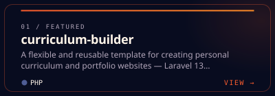
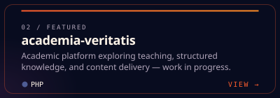
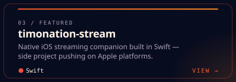
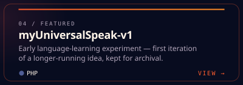
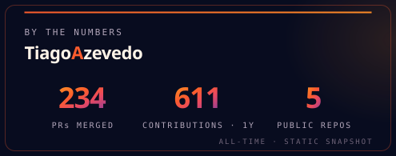
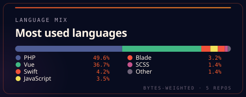
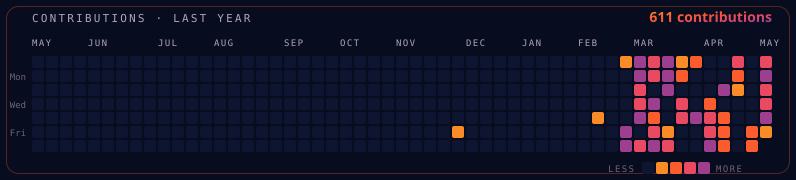

<!--
  azevedotiago/azevedotiago — profile README
  Sunset brand system mirrored from https://tiagoazevedo.pt
  Tokens: coral #FB5C2D · orange #FB8B27 · pink #E94961 · magenta #9D3F8E
          deep #080C1F · navy #1B2545 · cream #FFF4E8
-->

<picture>
  <source media="(prefers-color-scheme: dark)" srcset="./assets/brand/hero-banner-dark.svg">
  <source media="(prefers-color-scheme: light)" srcset="./assets/brand/hero-banner-light.svg">
  
</picture>

<p align="center">
  <a href="https://tiagoazevedo.pt"></a>
  &nbsp;
  <a href="mailto:tiagoazevedo22@icloud.com"></a>
  &nbsp;
  <a href="https://www.linkedin.com/in/azevedotiago"></a>
  &nbsp;
  <a href="https://github.com/azevedotiago?tab=repositories"></a>
</p>

<br>

<!-- ───────────────────────────  01 / ABOUT  ─────────────────────────── -->

<h2>
  <br>
  <sub><code>01</code></sub>&nbsp;·&nbsp;About
</h2>

<table>
  <tr>
    <td width="60%" valign="top">
      <p>
        Senior full-stack engineer based in Portugal. I build production web platforms end-to-end —
        Laravel APIs, Vue 3 SPAs, dockerised infra — with an eye on craft, clarity, and the kind of
        details users feel rather than notice. Currently shipping
        <a href="https://github.com/azevedotiago/curriculum-builder"><b>curriculum-builder</b></a>,
        a reusable portfolio template, and exploring iOS / Swift on the side.
      </p>
      <p>
        I care about: type systems, accessible UI, integration tests over mocks, design systems that
        survive contact with real product, and infra you can rebuild from a fresh clone with one
        command.
      </p>
    </td>
    <td width="40%" valign="top">
      <table>
        <tr><td><sub><code>LOCATION</code></sub></td><td>Portugal</td></tr>
        <tr><td><sub><code>ROLE&nbsp;&nbsp;&nbsp;&nbsp;</code></sub></td><td>Senior full-stack</td></tr>
        <tr><td><sub><code>FOCUS&nbsp;&nbsp;&nbsp;</code></sub></td><td>Laravel · Vue · Docker</td></tr>
        <tr><td><sub><code>FREELANCE</code></sub></td><td>Selective availability</td></tr>
        <tr><td><sub><code>LANGUAGES</code></sub></td><td>EN · PT</td></tr>
      </table>
    </td>
  </tr>
</table>

<br>

<!-- ───────────────────────────  02 / STACK  ─────────────────────────── -->

<h2>
  <br>
  <sub><code>02</code></sub>&nbsp;·&nbsp;Stack
</h2>

<p><sub><b>Backend & web</b></sub></p>
<p>
  
  
  
  
  
  
</p>

<p><sub><b>Frontend</b></sub></p>
<p>
  
  
  
  
  
  
</p>

<p><sub><b>Data</b></sub></p>
<p>
  
  
  
  
</p>

<p><sub><b>DevOps & tooling</b></sub></p>
<p>
  
  
  
  
  
  
  
</p>

<p><sub><b>Embedded & systems</b></sub></p>
<p>
  
  
  
</p>

<br>

<!-- ─────────────────────────  03 / FEATURED  ─────────────────────────── -->

<h2>
  <br>
  <sub><code>03</code></sub>&nbsp;·&nbsp;Featured&nbsp;projects
</h2>

<table>
  <tr>
    <td width="50%">
      <a href="https://tiagoazevedo.pt#portfolio">
        
      </a>
    </td>
    <td width="50%">
      <a href="https://tiagoazevedo.pt#portfolio">
        
      </a>
    </td>
  </tr>
  <tr>
    <td width="50%">
      <a href="https://tiagoazevedo.pt#portfolio">
        
      </a>
    </td>
    <td width="50%">
      <a href="https://tiagoazevedo.pt#portfolio">
        
      </a>
    </td>
  </tr>
</table>

<p align="center">
  <sub><code>SOURCE PRIVATE&nbsp;·&nbsp;FULL CASE STUDIES AT&nbsp;</code></sub><a href="https://tiagoazevedo.pt#portfolio"><sub><code>TIAGOAZEVEDO.PT</code></sub></a>
</p>

<br>

<!-- ───────────────────────────  04 / SIGNAL  ─────────────────────────── -->

<h2>
  <br>
  <sub><code>04</code></sub>&nbsp;·&nbsp;Signal
</h2>

<p align="center">
  
  &nbsp;
  
</p>

<p align="center">
  
</p>

<br>

<!-- ──────────────────────────  05 / CONNECT  ─────────────────────────── -->

<h2>
  <br>
  <sub><code>05</code></sub>&nbsp;·&nbsp;Connect
</h2>

<table>
  <tr>
    <td><sub><code>WEBSITE&nbsp;&nbsp;</code></sub></td>
    <td><a href="https://tiagoazevedo.pt"><b>tiagoazevedo.pt</b></a> — portfolio, case studies, full CV</td>
  </tr>
  <tr>
    <td><sub><code>EMAIL&nbsp;&nbsp;&nbsp;&nbsp;</code></sub></td>
    <td><a href="mailto:tiagoazevedo22@icloud.com">tiagoazevedo22@icloud.com</a></td>
  </tr>
  <tr>
    <td><sub><code>LINKEDIN&nbsp;</code></sub></td>
    <td><a href="https://www.linkedin.com/in/azevedotiago">linkedin.com/in/azevedotiago</a></td>
  </tr>
</table>

<br>

<details>
  <summary><sub><code>$&nbsp;./whoami&nbsp;--verbose</code></sub></summary>
  <br>

```text
~ $ whoami
tiago

~ $ cat ./manifest.txt
> ship things that hold up under load
> read the source before reaching for the docs
> tests > types > comments > prose
> if it can be a one-liner in the readme, it should be
> the dev experience IS the product

~ $ uptime --since=2014
loading sunset.theme … done
```

</details>

<br>
<br>

<!-- ─────────────────────────────  FOOTER  ──────────────────────────── -->

<p align="center">
  <picture>
    <source media="(prefers-color-scheme: dark)" srcset="./assets/brand/logo-banner-dark.svg">
    <source media="(prefers-color-scheme: light)" srcset="./assets/brand/logo-banner-light.svg">
    
  </picture>
</p>

<p align="center">
  <sub><code>© 2026&nbsp;·&nbsp;BUILT WITH CRAFT&nbsp;·&nbsp;SUNSET BUILD v1</code></sub>
</p>
